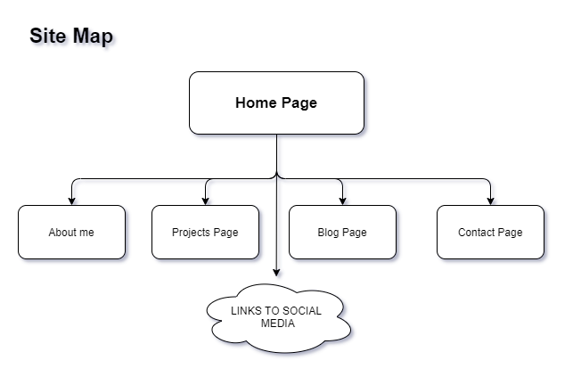
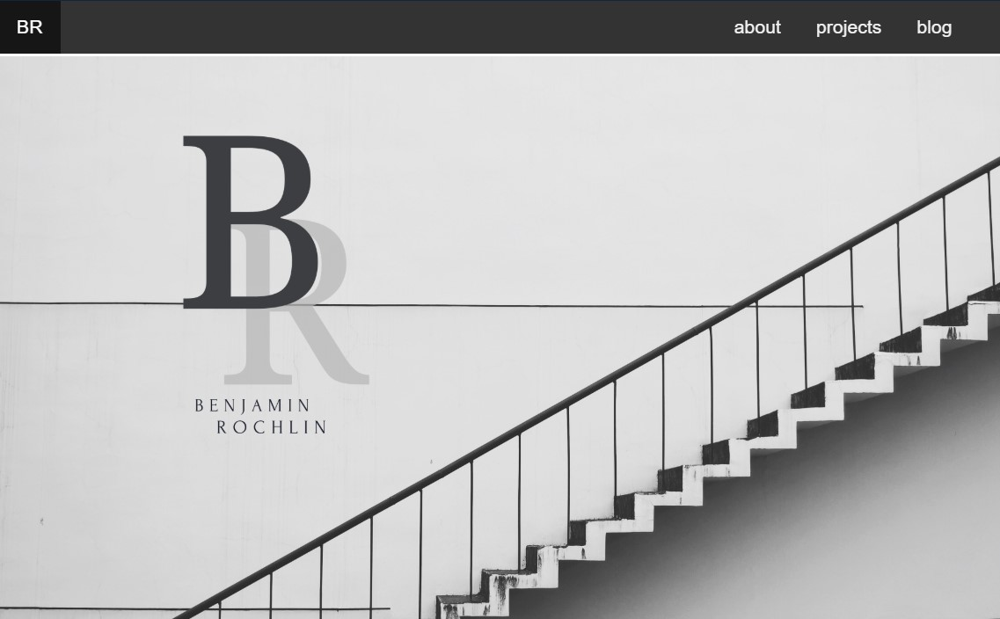
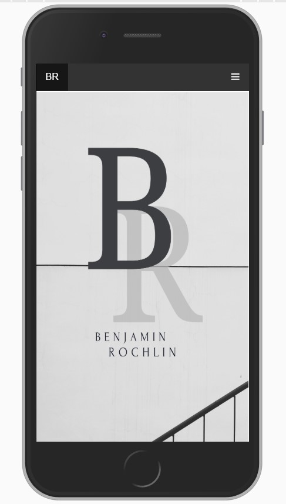
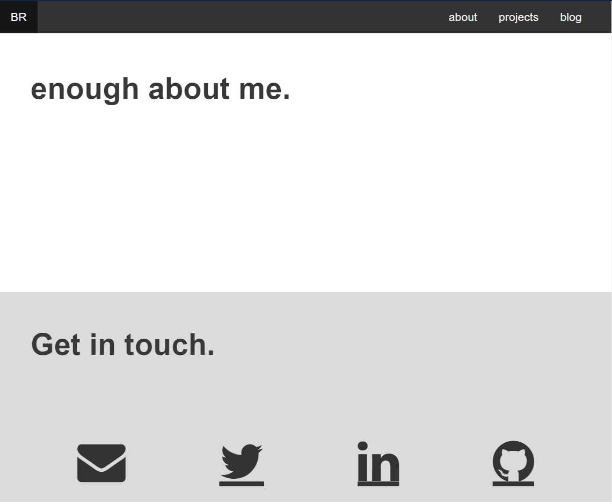
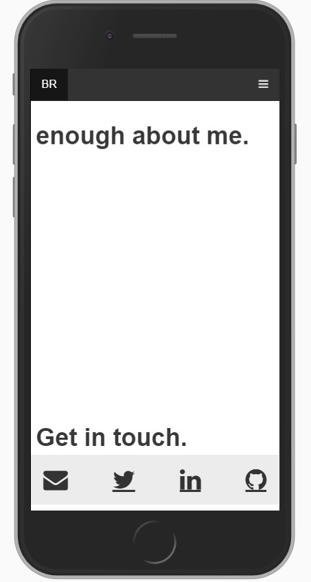

# Benjamin Rochlin, T1A3 Portfolio Website. 

----
## Links
 See [My-Website](https://en.wikipedia.org/wiki/Markdown), See the source code at [github](https://en.wikipedia.org/wiki/Markdown)

----
## Description
The purpose of this website is to act as a publically accessible portfolio which aims to highlight and demonstrate the website creator's ability to utislise and implement several modern day web technologies which is logically layed out and responsive to all commonly used device resolutions.

---
## Site map

----
## Features
Alot of the websites functionality and features are directly related to the visual themes and concepts at the core of its design. The core theme was to achieve a minimal yet elegant black and white composition, this was quite a time consuming process. To keep the colour scheme minimal and consistent every element on the whole website had to be altered or filtered to ensure it was on 'brand'. The main header of the website was custom designed and ended up dictating which elements and colour choices would be suitable throughout.    
### main header desktop:

### main header mobile:

It is worth noting that in this instance to ensure that the site was responsive, and that the image would still look good, an alternate version of the header image was used which was more suited to a mobile phone screen resolution. There are several other instances in the project where certain elements had to be changed to ensure that the design and theme would look great with any device.

wide screen:

for mobile:

Another feature that was prominately used through out was 'sticky items' which allowed for some very groovy transitions and great visual design options. It cannot really be demonstrated here unfortunately, but just have a scroll down the site and see which elements move, and which stay put. The 'sticky' items were used on the blog page for blog entry titles, and on the home page to create intresting transistions whilst scrolling, these sticky elements also required tweaking for different screen resolutions.

## Target Audience
It is my hope that this website will be used as a starting point for a budding young web developer, and can be used as a promotional item which a potential employer or customer could have access to.

## Tech stack
The construction of this website used the following:

* 'gimp' for image manipulation
* HTML5
* CSS
* flex box 
* (tiny bit) of Javascript for responsive navbar
* Responsive Design concepts

Source control was managed with 'Git'   The source code has been hosted on GitHub   The website was deployed with netlify

---
---
### end of document